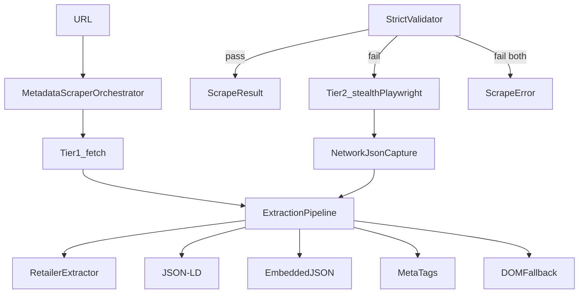

# Giftistry API Architecture

## Overview

Giftistry-bun follows **Domain-Driven Design (DDD)** with a rich domain model. Each bounded context is organized into four layers with strict dependency rules.

## Layer Structure

```
modules/<context>/
├── domain/           # Entities, value objects, ports, domain services
├── application/      # Use cases (orchestration only)
├── infrastructure/   # Port implementations (Postgres, SMTP, AI, etc.)
└── presentation/     # Thin HTTP routes and middleware
```

### Dependency direction

```
presentation → application → domain ← infrastructure
```

- **Domain** has no outward dependencies (no `sql`, HTTP, Elysia).
- **Application** depends only on domain ports and entities.
- **Infrastructure** implements domain ports.
- **Presentation** delegates to use cases; no business logic.

## Naming conventions

| Pattern | Example | Layer |
|---------|---------|-------|
| `*UseCase` | `AddItemUseCase` | application |
| `*Repository` (interface) | `ItemRepository` | domain/ports |
| `Postgres*Repository` | `PostgresItemRepository` | infrastructure |
| `*.vo.ts` | `Email`, `Money` | domain (value objects) |
| `*.routes.ts` | `item.routes.ts` | presentation |

## Rich domain model

Entities carry behavior; use cases orchestrate:

```typescript
// Use case orchestrates
const user = await userRepo.findByEmail(email);
user.assertCanLogin(sitePolicy);
user.recordFailedLogin();
await userRepo.update(user);
```

Value objects validate at construction:

```typescript
const email = Email.create(rawEmail); // throws DomainError if invalid
```

## Shared kernel

Cross-cutting value objects and ports live in `src/common/domain/`:

- Value objects: `Email`, `Money`, `Username`, `ListRole`, `SitePolicy`
- Ports: `SitePolicyRepository`, `UserPolicyRepository`, `AuditLogRepository`
- Use cases: `GetSitePolicyUseCase`, `WriteAuditLogUseCase`, etc.

## Composition root

All dependency wiring happens in `src/app.container.ts`. Modules do not export concrete repository singletons.

## Metadata scraper

Product link metadata is scraped through a tiered self-hosted pipeline in the item module.



### Layers

- **Port:** `MetadataScraper` in `src/modules/item/domain/ports/metadata-scraper.port.ts`
- **Orchestrator:** `MetadataScraperOrchestrator` — fetch then Playwright failover
- **Extractors:** `src/modules/item/infrastructure/scraping/extractors/` — meta tags, JSON-LD, embedded JSON, DOM, slug fallback
- **Retailers:** `src/modules/item/infrastructure/scraping/retailers/` — hostname-specific parsers (Amazon, Walmart, Target, Dick's, Shopify)
- **Use cases:** `ExtractMetadataUseCase` (full), `EnrichLinkMetadataUseCase` (minimal, background)

### Environment variables

| Variable | Default | Purpose |
|----------|---------|---------|
| `SCRAPE_FETCH_TIMEOUT_MS` | `8000` | Fetch tier timeout |
| `SCRAPE_PLAYWRIGHT_TIMEOUT_MS` | `25000` | Browser navigation timeout |
| `SCRAPE_PLAYWRIGHT_MAX_CONCURRENT` | `3` | Max concurrent browser contexts |
| `SCRAPE_PLAYWRIGHT_HEADLESS` | `true` | Headless browser (set `false` for local debugging) |
| `SCRAPE_PLAYWRIGHT_EXECUTABLE_PATH` | _(auto)_ | Chromium/Chrome binary for Playwright. Required on NixOS unless a system browser is already on `PATH`. Also accepts `PLAYWRIGHT_CHROMIUM_EXECUTABLE_PATH`. |

### NixOS note

Playwright’s downloaded Chromium is a generic glibc binary and will fail with `Could not start dynamically linked executable` / `stub-ld` on NixOS. Point Playwright at a Nix-provided browser instead:

```bash
nix-shell -p chromium
export SCRAPE_PLAYWRIGHT_EXECUTABLE_PATH="$(command -v chromium)"
```

Or enable `programs.nix-ld` so the bundled Playwright browser can run.

### Known limitations

Self-hosted scraping from a datacenter/server IP cannot reliably bypass Akamai Bot Manager on heavily protected retailers (e.g. Dick's Sporting Goods). The scraper detects block pages and returns explicit failures with `diagnostics.blocked: true` rather than empty success responses.

To add a new retailer extractor, create a file in `scraping/retailers/` implementing `RetailerExtractor` and register it in `extraction-pipeline.ts`.

## Rules (enforced by CI)

1. No `sql` imports outside `infrastructure/` directories.
2. No static service classes in `common/services/`.
3. Routes delegate exclusively to use cases.
4. External systems (email, AI, scraping) are accessed through domain ports.
