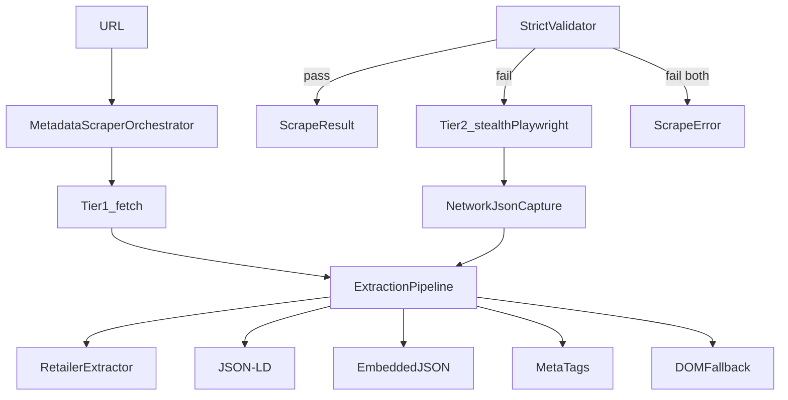

# Giftistry API Architecture

Giftistry-bun uses **hexagonal (ports & adapters)** modules with a DDD-style layering. Large modules organize use cases into **behavior slices**; compact modules keep them under `application/`. Every use case file lives in a `use-cases/` folder.

## Module layout

```
modules/<context>/
├── index.ts           # Public barrel — preferred cross-module import path
├── <context>.module.ts
├── domain/            # Entities, VOs, ports, events, domain helpers
├── slices/<behavior>/ # Feature slices (large modules)
│   ├── use-cases/     # *.use-case.ts
│   ├── interfaces/    # payloads / results
│   └── utils/         # slice helpers
├── application/       # Compact use cases and/or published ports / runner
│   ├── use-cases/     # *.use-case.ts (compact modules)
│   ├── ports/         # published application ports
│   └── utils/
├── infrastructure/    # Port adapters (Postgres, SMTP, AI, WS, scrapers)
└── presentation/      # Thin HTTP routes + use-case facades
```

### Slices vs `application/`

| Pattern | When | Examples |
|---------|------|----------|
| `slices/<behavior>/use-cases/` | Many use cases; group by behavior | admin, auth, item, jobs, system, wishlist |
| `application/use-cases/` only | Few use cases; flat is enough | comment, friends, invites, notifications, registration-invite |
| Hybrid | Slices for features + `application/` for shared ports/runner | item, wishlist (ports); jobs (runner + notify) |

`check:layers` treats `application/` and `slices/` the same for dependency rules.

### Dependency direction

```
presentation → application|slices → domain ← infrastructure
```

- **Domain** — no `sql`, HTTP, Elysia, or infrastructure imports.
- **Application / slices** — depend on domain ports/entities and other modules via **public barrels** (`@/modules/<context>`). Do not import `*/infrastructure/*`.
- **Infrastructure** — implements ports; constructed only in the composition root.
- **Presentation** — parse/auth → use case → DTO; no business rules.
- Cross-module deep imports are discouraged (`check:layers`; strict with `STRICT_MODULES=1`).

## Public barrels

Each module exports a stable surface from `src/modules/<context>/index.ts` (factories, selected types/ports, events, a few use cases other modules need). Prefer:

```typescript
import { createItemModule, ItemRemovedEvent } from '@/modules/item';
```

over deep paths into another module’s slices or infrastructure.

## Composition root

Wiring lives outside modules:

| File | Role |
|------|------|
| `src/boot/wire-adapters.ts` | `createInfrastructureAdapters()` — concrete driven adapters |
| `src/boot/runtime-publishers.ts` | Direct WS vs Postgres NOTIFY realtime publishers |
| `src/app.container.ts` | `createAppContainer()` — adapters → module factories → event handlers |

Module factories (`createXModule`) receive ports; they must not `new` adapters. Entries: `src/index.ts` (API), `src/worker.ts` (jobs).

## DomainError → HTTP

Domain/application throw `DomainError` with a stable `errorCode` (`NOT_FOUND`, `FORBIDDEN`, `UNAUTHORIZED`, `BAD_REQUEST`, `VALIDATION`, `CONFLICT`, `MAINTENANCE`, …). HTTP status is mapped at the edge in `handleError` (`src/common/middlewares/error.middleware.ts`), not inside use cases.

| `errorCode` | Status |
|-------------|--------|
| `NOT_FOUND` | 404 |
| `FORBIDDEN` | 403 |
| `UNAUTHORIZED` | 401 |
| `BAD_REQUEST` / `VALIDATION` | 400 |
| `CONFLICT` | 409 |
| `MAINTENANCE` | 503 |
| `INTERNAL_SERVER_ERROR` | 500 |

Envelope: `{ Status: 'error', Code, Message }`.

## Domain events

Events extend `DomainEvent` (`src/common/domain/events/`) and are published through an in-process event bus wired in the container.

Example: deleting an item publishes `ItemRemovedEvent` (`item.removed`) from the item claims slice; notifications subscribe and create claimer alerts without the item module depending on notifications infrastructure.

Other events: `FriendRequestSentEvent`, `FriendRequestAcceptedEvent`, `InviteAcceptedEvent`, `WishlistSharedEvent`.

## File conventions

| Kind | Location / suffix | Rule |
|------|-------------------|------|
| Interface | `interfaces/<name>.interface.ts` or colocated `*.interface.ts` | Prefer one exported interface per file |
| Type alias | `*.type.ts` or `interfaces/` | Same |
| Port | `domain/ports/` or `application/ports/` — `*.port.ts` / `*.repository.ts` | One port per file |
| Constants | `constants/<topic>.constant.ts` or `*.constant.ts` | Group related tables; not one file per constant |
| Util | `<layer>/utils/<name>.util.ts` | Always under a `utils/` folder (domain, application, slices, infrastructure, or `common/utils`) |
| Use case | `<layer>/use-cases/<action>.use-case.ts` | Always under a `use-cases/` folder (`slices/<behavior>/use-cases/` or `application/use-cases/`) |
| Entity / VO / event | `*.entity.ts`, `*.vo.ts`, `*.event.ts` | Domain only |

Checks: `bun run check:layers`, `bun run check:contracts` (warn by default; `STRICT=1` to fail), `bun run check:sql`.

## Naming

| Pattern | Example | Layer |
|---------|---------|-------|
| `*UseCase` | `AddItemUseCase` | application / slices |
| `*Repository` | `ItemRepository` | domain port |
| `Postgres*Repository` | `PostgresItemRepository` | infrastructure |
| `*.routes.ts` | `item.routes.ts` | presentation |
| `index.ts` | `@/modules/item` | public barrel |

## Rich domain model

Entities carry behavior; use cases orchestrate:

```typescript
const user = await userRepo.findByEmail(email);
user.assertCanLogin(sitePolicy);
user.recordFailedLogin();
await userRepo.update(user);
```

Value objects validate at construction (`Email.create` → `DomainError` if invalid).

## Shared kernel

`src/common/domain/`: shared VOs at the root (`*.vo.ts` — `Email`, `Money`, `Username`, …), ports under `ports/` (including `EventBus`), `DomainError` / `DomainEvent`, and policy helpers under `utils/` (password constants under `constants/`). Shared use cases live under `src/common/application/`.

`src/common/infrastructure/`: shared adapters only — `repositories/` (Postgres site/user policy + audit log), `secrets/` (`providers/`, `sources/`, JWT helpers), and `in-process-event-bus.ts`. Prefer `@/common/config/utils/server-config-file.util` for `loadConfig` (no SQL side effect).

## Metadata scraper

Product link metadata is scraped through a tiered pipeline in the item module.


```mermaid
flowchart TD
  URL[URL] --> Orchestrator[MetadataScraperOrchestrator]
  Orchestrator --> Fetch[Tier1_fetch]
  Fetch --> Pipeline[ExtractionPipeline]
  Pipeline --> Retailer[RetailerExtractor]
  Pipeline --> JsonLd[JSON-LD]
  Pipeline --> Embedded[EmbeddedJSON]
  Pipeline --> Meta[MetaTags]
  Pipeline --> Dom[DOMFallback]
  Validate[StrictValidator] -->|pass| Result[ScrapeResult]
  Validate -->|fail| Playwright[Tier2_stealthPlaywright]
  Playwright --> NetworkCapture[NetworkJsonCapture]
  NetworkCapture --> Pipeline
  Validate -->|fail both| Error[ScrapeError]
```

- **Port:** `MetadataScraper` — `src/modules/item/domain/ports/metadata-scraper.port.ts`
- **Orchestrator / scrapers:** `src/modules/item/infrastructure/adapters/`
- **Extractors / retailers:** `src/modules/item/infrastructure/scraping/`
- **Use cases:** `ExtractMetadataUseCase`, `EnrichLinkMetadataUseCase` (metadata slice)

| Variable | Default | Purpose |
|----------|---------|---------|
| `SCRAPE_FETCH_TIMEOUT_MS` | `8000` | Fetch tier timeout |
| `SCRAPE_PLAYWRIGHT_TIMEOUT_MS` | `25000` | Browser navigation timeout |
| `SCRAPE_PLAYWRIGHT_MAX_CONCURRENT` | `3` | Max concurrent browser contexts |
| `SCRAPE_PLAYWRIGHT_HEADLESS` | `true` | Headless browser |
| `SCRAPE_PLAYWRIGHT_EXECUTABLE_PATH` | _(auto)_ | Chromium path (needed on NixOS) |

On NixOS, point Playwright at a Nix browser (`SCRAPE_PLAYWRIGHT_EXECUTABLE_PATH`) or enable `programs.nix-ld`. Heavily protected retailers may return `diagnostics.blocked: true` rather than empty success.

## Shared database

Public import path is `@/common/database` ([`src/common/database/index.ts`](../src/common/database/index.ts)). That barrel exports the SQL proxy, pool lifecycle, `loadConfig` / `saveConfig`, `initializeSchema`, and `runMigrations`.

```
common/database/
├── index.ts              # Public API + pool bootstrap
├── constants/            # ACTIVE_SQL
├── interfaces/           # SqlClient
├── utils/                # pool proxy, create client, ping/close, saveConfig
├── schema/               # initializeSchema (DDL)
├── migrations/           # runMigrations, legacy up, data migrations
└── seeds/                # field-definition seeds
```

`config.json` normalize/load/write lives in `common/config/utils/` (no SQL side effect). `saveConfig` stays under `common/database/utils/` because it reinitializes the pool after writing.

## Rules (CI)

1. No `sql` / `common/database` outside infrastructure, DB bootstrap, and entrypoints. Prefer `@/common/database` over deep paths.
2. Application/slices must not import infrastructure.
3. Domain must not import application/slices or infrastructure.
4. Routes delegate to use cases; external I/O goes through ports.
5. Prefer module barrels over cross-module deep imports.

## Related

- [Development](development.md) — scripts, verify, env
- [Install](INSTALL.md) — NixOS / local Bun
- [Source map](../src/README.md)
- [Modules](../src/modules/README.md)
- [Contributing](../CONTRIBUTING.md)
